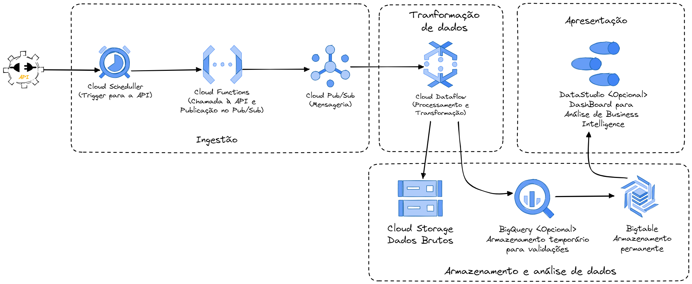

4) Imagine que o Json das notas fiscais é disponibilizado em uma API. Como você utilizaria as tecnologias da GCP para ingerir, transformar e, eventualmente, carregar esses dados em um BigTable? O quarto entregável consiste na construção de uma arquitetura de ingestão dos dados de nota fiscal do entregável anterior (como visto <a href="hsrc/ttps://www.crystalloids.com/hs-fs/hubfs/Screenshot%202022-02-04%20at%2009-44-40-png.png?width=1232&name=Screenshot%202022-02-04%20at%2009-44-40-png.png">aqui</a>), a qual deve atender aos seguintes pontos:

- Esquemas de fluxo de dados;
- Descrições de funcionamento (se necessário);
- Nomes de tecnologias em ecossistema GCP (serviços, conectores, bibliotecas e módulos).

Será apreciado como esforço extra se você conseguir avançar mais na aplicação além desse ponto.

## Solução

### Fluxo de dados

> #### 1. Ingestão de Dados
> 
> - <strong>Cloud Functions:</strong> Funções em nuvem que serão acionadas para fazer a chamada à API e extrair os dados no formato JSON.
>
> - <strong>Cloud Pub/Sub:</strong> Serviço de mensageria para garantir que os dados ingeridos sejam disponibilizados de forma confiável e escalável para o próximo estágio.
> #### 2. Transformação de Dados
> 
> - <strong>Cloud Dataflow:</strong> Serviço para processamento em tempo real dos dados extraídos. Aqui, os dados podem ser limpos, transformados e preparados conforme necessário.
> #### Armazenamento e Análise de Dados
> 
> - <strong>BigQuery:</strong> Armazenamento temporário e análise dos dados transformados. Opcionalmente, para análises mais complexas antes de carregar no Bigtable.
>
> - <strong>Cloud Storage:</strong> Para armazenamento de backups dos dados em formato bruto e processado, se necessário.
>
> - <strong>Bigtable:</strong> Base de dados NoSQL escalável e performática onde os dados finais serão armazenados.

### Descrição do Funcionamento

> #### 1. Cloud Scheduller
> - Dispara periodicamente a Cloud Function para fazer a chamada à API.
> 
> #### 2. Cloud Functions
> 
> - Função em Python que faz a chamada à API, processa a resposta JSON e publica a mensagem no Cloud Pub/Sub.
> 
> #### 3. Cloud Pub/Sub
> 
> - Criação de um tópico para receber as mensagens da Cloud Function.
> - Garantia de entrega e armazenamento temporário das mensagens para processamento assíncrono assim fornecendo uma entrega confiável para o próximo estágio.
> 
> #### 4. Cloud Dataflow
> 
> - Pipeline para consumir mensagens do Pub/Sub, transformar os dados conforme as regras de negócio, e carregar os dados transformados no BigQuery e/ou Cloud Storage.
> - Configuração de jobs escaláveis para processamento paralelo dos dados.
>
> #### 5. Cloud Storage
>
> - Armazena backups dos dados brutos e processados, garantindo que os dados estejam disponíveis para recuperação se necessário.
>
> #### 6. BigQuery (Opcional)
> 
> - Tabela temporária para análise de dados transformados.
> - Execução de queries para validação e análise ad hoc.
> 
> #### 7. Bigtable
> 
> - Carregamento dos dados transformados e validados do Dataflow diretamente no Bigtable para armazenamento permanente.
> - Configuração de tabelas e colunas de acordo com a estrutura dos dados.

### Tecnologias GCP Utilizadas

> - <strong>Cloud Scheduller</strong>
> 
> Funções em nuvem para gerenciamento de trigger de tempo ou evento, para execuções automáticas de jobs.
> 
> - <strong>Cloud Functions</strong>
> 
> Funções em nuvem para ingestão inicial de dados via chamadas à API.
> 
> - <strong>Cloud Pub/Sub</strong>
> 
> Serviço de mensageria para entrega confiável dos dados para > processamento.
> 
> - <strong>Cloud Dataflow</strong>
> 
> Plataforma de processamento de dados para transformação em tempo > real.
> 
> - <strong>Cloud Storage</strong>
> 
> Armazenamento de backups dos dados.> 
> - <strong>BigQuery (Opcional)</strong>
> 
> Armazenamento temporário e análise de dados.
> 
> - <strong>Bigtable</strong>
> 
> Armazenamento permanente dos dados transformados e carregados.

## Fluxo proposto
